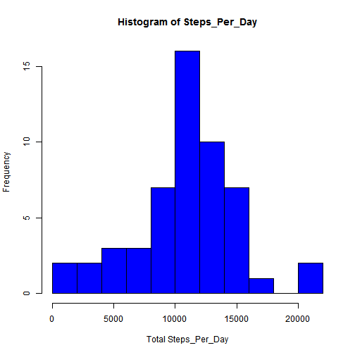
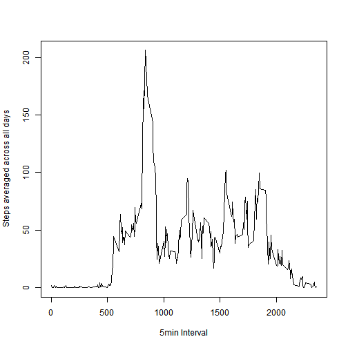
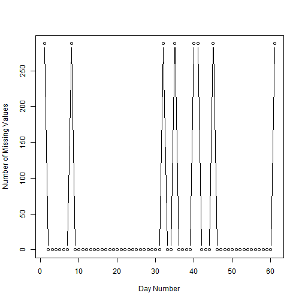
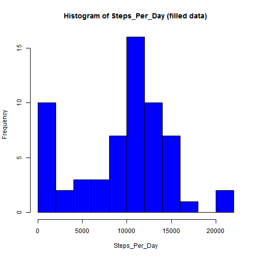
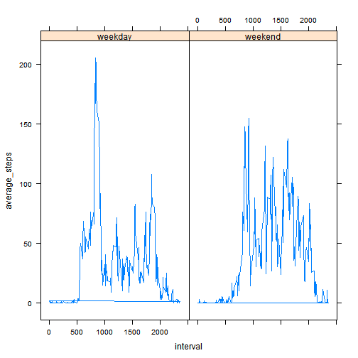

Assignment 1
=================================================================================================

Data from a personal monitoring device was downloaded as follows:


```r
setwd("C://Users//solasoy//Dropbox//R//Coursera//Reproducible Research")
x <- read.csv('activity.csv')
```

# Q1: What is the mean total number of steps taken per day?

### 1. Calculate total number of steps taken per day


```r
grp <- split(as.numeric(x$steps),x$date)
spd <- sapply(grp,sum)
data.frame(steps_per_day=spd)
```

```
##            steps_per_day
## 2012-10-01            NA
## 2012-10-02           126
## 2012-10-03         11352
## 2012-10-04         12116
## 2012-10-05         13294
## 2012-10-06         15420
## 2012-10-07         11015
## 2012-10-08            NA
## 2012-10-09         12811
## 2012-10-10          9900
## 2012-10-11         10304
## 2012-10-12         17382
## 2012-10-13         12426
## 2012-10-14         15098
## 2012-10-15         10139
## 2012-10-16         15084
## 2012-10-17         13452
## 2012-10-18         10056
## 2012-10-19         11829
## 2012-10-20         10395
## 2012-10-21          8821
## 2012-10-22         13460
## 2012-10-23          8918
## 2012-10-24          8355
## 2012-10-25          2492
## 2012-10-26          6778
## 2012-10-27         10119
## 2012-10-28         11458
## 2012-10-29          5018
## 2012-10-30          9819
## 2012-10-31         15414
## 2012-11-01            NA
## 2012-11-02         10600
## 2012-11-03         10571
## 2012-11-04            NA
## 2012-11-05         10439
## 2012-11-06          8334
## 2012-11-07         12883
## 2012-11-08          3219
## 2012-11-09            NA
## 2012-11-10            NA
## 2012-11-11         12608
## 2012-11-12         10765
## 2012-11-13          7336
## 2012-11-14            NA
## 2012-11-15            41
## 2012-11-16          5441
## 2012-11-17         14339
## 2012-11-18         15110
## 2012-11-19          8841
## 2012-11-20          4472
## 2012-11-21         12787
## 2012-11-22         20427
## 2012-11-23         21194
## 2012-11-24         14478
## 2012-11-25         11834
## 2012-11-26         11162
## 2012-11-27         13646
## 2012-11-28         10183
## 2012-11-29          7047
## 2012-11-30            NA
```

### 2. Plot histogram of the total number of steps taken each day


```r
hist(spd[!is.na(spd)],
     breaks=12,
     col="blue",
     main = "Histogram of Steps_Per_Day",
     xlab = "Total Steps_Per_Day")
```

 

### 3. Calucluate mean and median of the total number of steps taken per day


```r
mean(spd[!is.na(spd)])
```

```
## [1] 10766.19
```

```r
median(spd[!is.na(spd)])
```

```
## [1] 10765
```

# Q2: What is the average daily activity pattern?

### 1. Generate time series plot of the 5-minute interval (x-axis) and the average number of steps taken, averaged across all days (y-axis)


```r
n <- split(as.numeric(x$steps[!is.na(x$steps)]),x$interval[!is.na(x$steps)])
avg_steps <- sapply(n,mean)
interval = unique(x$interval)

plot(interval,avg_steps,type="l",
     xlab="5min Interval",
     ylab= "Steps averaged across all days")
```

 

### 2. Determine the 5-minute interval that corresponds to the maximum number of steps (averages across all the days in the dataset)


```r
interval[avg_steps == max(avg_steps)]
```

```
## [1] 835
```

# Q3: Imputing missing values

### 1. Total number of missing values in the dataset 


```r
length(x[is.na(x[,1]),1])
```

```
## [1] 2304
```

### 2. Determine distribution of missing values in dataset


```r
v <- unique(x$date)
h <- seq(1,length(v))
for (k in 1:length(h)) h[k] <- length(x[is.na(x$steps) & x$date==v[k],1])
plot(h,type="b",xlab="Day Number",ylab="Number of Missing Values")
```

 

#### The plot above indicates that the missing values are limited to only 8 of the 61 days of this experiment. On each of the 8 days, no steps were recored i.e. all  288 measurements are missing


### 3. Create new dataset with missing values replaced with median value of steps at each interval across all days


```r
median_steps <- sapply(n,median)
x_fill = x
for (j in 1:length(v)) {
  if (length(x_fill[is.na(x_fill$steps) & x_fill$date==v[j],1])==288) {
    x_fill[is.na(x_fill$steps) & x_fill$date==v[j],1] <- median_steps 
  } 
}
```

### 4. Generate histogram of total number of steps from new dataset and compare with original


```r
grp_fill <- split(x_fill$steps,x_fill$date)
spd_fill <- sapply(grp_fill,sum)

hist(spd_fill,
     breaks=12,
     col="blue",
     main = "Histogram of Steps_Per_Day (filled data)",
     xlab = "Steps_Per_Day")
```

 

#### From the histogram above, we observe a larger frequency of total number of steps per day that is approximately 2000 or less, relative to the initial histogram; otherwise the frequency distribution for this histogram is similar to the first one.

### 5. Mean and median total number of steps taken per day from new dataset


```r
mean(spd_fill)
```

```
## [1] 9503.869
```

```r
median(spd_fill)
```

```
## [1] 10395
```

# Q4: Are there differences in activity patterns between weekdays and weekends?

### 1. Create a new factor variable in the dataset with two levels - "weekday" and "weekend"


```r
u <- weekdays(as.Date(x_fill$date))
h <- unique(x_fill$date)
tarray <- seq(as.POSIXct(h[1]), as.POSIXct(h[length(h)]),"days")
w <- weekdays(tarray)
day_flag <- array(0,length(u))
for (j in 1:length(w)) {
  if (w[j] =="Saturday" | w[j]=="Sunday") day_flag[u==w[j]] = "weekend"
}
day_flag [day_flag==0]="weekday"
x_new <- data.frame(cbind(x_fill,day_flag))
```

### 2. Generate panel plot containing a time series plot of the 5-minute interval (x-axis) and the average number of steps taken, averaged across all weekday days or weekend days (y-axis). 


```r
library(lattice)

avg <- array(0,dim(x_new)[1])
for (i in 1:length(interval)) {
  avg[x_new$interval==interval[i] & x_new$day_flag == "weekday"] <- 
    mean(x_new[x_new$interval==interval[i] & x_new$day_flag == "weekday","steps"])
  
  avg[x_new$interval==interval[i] & x_new$day_flag == "weekend"] <- 
    mean(x_new[x_new$interval==interval[i] & x_new$day_flag == "weekend","steps"])               
}

df <- data.frame(interval=x_new$interval,
      average_steps=as.numeric(avg),
      day_flag=x_new$day_flag)

xyplot(average_steps ~ interval | day_flag,type = "l",df)
```

 
