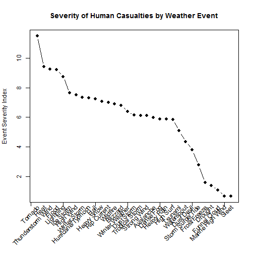
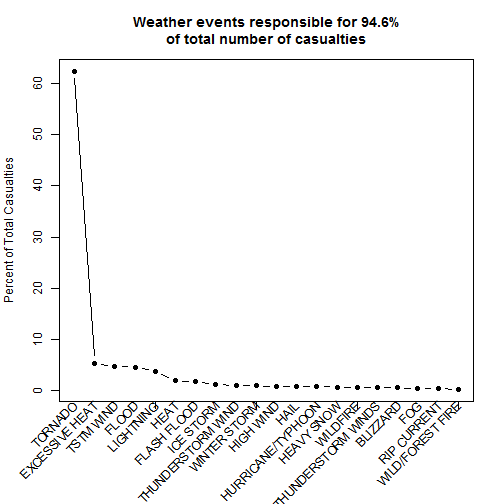

An Evaluation of Severe Weather Data from 1950 - 2011
==============================================================================
## Synopsis: 
### This report evaluates weather data acquired over 60 years (1950-2011) by the National Oceanic and Atmospheric Administration (NOAA). The analysis is narrowly focused on determining (1) the weather events that are most harmful to human health and (2) which weather events have the greatest ecomonic consequences across the United States. The analysis shows that 20 of the 985 unique weather events recorded over the measurement period account for 95% of all weather-related casualties (including injuries and fatalities) in the United States. Furthermore, 11 specific weather events are the most consequential with respect to property and crop damage across all 50 states.

## Data Processing: 
###The NOAA database was downloaded from web via the John Hopkins Coursera portal and stored on the computer with which the analysis was done. The .csv file (repdata-data-StormData.csv) was then loaded in the R environment as follows:


```r
setwd("C://Users//solasoy//Dropbox//R//Coursera//Reproducible Research")
x <- read.csv(file='repdata-data-StormData.csv',
              colClasses="character")
```
###Next, for each of the 985 unique weather events, the number of total number of fatalities and injuries across the data sampling period was summed to give the number of casualties stemming from this weather activity.


```r
x$INJURIES <- as.numeric(x$INJURIES)
x$FATALITIES <- as.numeric(x$FATALITIES)

u <- unique(x$EVTYPE) # unique weather events
y <- matrix(0,length(u),2)
for (j in 1:length(u)) {
  y[j,] <- colSums(x[x$EVTYPE == u[j],c("FATALITIES","INJURIES")],na.rm=TRUE)
}
  
index <- order(as.numeric(rowSums(y)),as.numeric(y[,2]),as.numeric(y[,1]),decreasing=TRUE)
df <- data.frame(EVENT=u[index],FATALITIES=as.numeric(y[index,1]),
    INJURIES=as.numeric(y[index,2]),CASUALTY_COUNT=as.numeric(rowSums(y[index,])),
    PERCENT_OF_TOTAL=100*as.numeric(rowSums(y[index,]))/sum(as.numeric(rowSums(y))))
```

###An event severity index for each weather event was determined by taking the log of all casualty numbers for, i.e. 


```r
event_severity_index <- log(df$CASUALTY_COUNT)
```

### The casualty data arising from all the monitored weather events were captured in a data frame. The top 20 weather events with respect to casualty levels, are as follows:


```r
head(df,20)
```

```
##                 EVENT FATALITIES INJURIES CASUALTY_COUNT PERCENT_OF_TOTAL
## 1             TORNADO       5633    91346          96979       62.2966089
## 2      EXCESSIVE HEAT       1903     6525           8428        5.4139125
## 3           TSTM WIND        504     6957           7461        4.7927386
## 4               FLOOD        470     6789           7259        4.6629795
## 5           LIGHTNING        816     5230           6046        3.8837820
## 6                HEAT        937     2100           3037        1.9508842
## 7         FLASH FLOOD        978     1777           2755        1.7697353
## 8           ICE STORM         89     1975           2064        1.3258561
## 9   THUNDERSTORM WIND        133     1488           1621        1.0412853
## 10       WINTER STORM        206     1321           1527        0.9809023
## 11          HIGH WIND        248     1137           1385        0.8896854
## 12               HAIL         15     1361           1376        0.8839041
## 13  HURRICANE/TYPHOON         64     1275           1339        0.8601363
## 14         HEAVY SNOW        127     1021           1148        0.7374432
## 15           WILDFIRE         75      911            986        0.6333789
## 16 THUNDERSTORM WINDS         64      908            972        0.6243857
## 17           BLIZZARD        101      805            906        0.5819892
## 18                FOG         62      734            796        0.5113282
## 19        RIP CURRENT        368      232            600        0.3854233
## 20   WILD/FOREST FIRE         12      545            557        0.3578013
```

###The following plot tracks the event severity index by weather type, and shows the most consequential weather events:


```r
par(mar = c(7, 4, 4, 2) + 0.1) ## Increase bottom margin to make room for rotated labels
plot(event_severity_index[1:20], xaxt = "n", pch=19,
     type=  "b",
     xlab = "",
     ylab="Event Severity Index",
     main="Top 20 most harmful weather events to humans")
axis(1, labels = FALSE)
labels <- df$EVENT[1:20]
text(1:20,par("usr")[3] - 0.25, srt = 45, adj = 1,
     labels = labels, xpd = TRUE)
```

 

###The following plot highlights the percentage of all weather-related casualties in the last 60 years that derive from each of the top 20 weather events:


```r
par(mar = c(7, 4, 4, 2) + 0.1) 
with(df,plot(PERCENT_OF_TOTAL[1:20],pch=19,
      ylab="Percent of Total Casualties",
      xlab=NA,
      type="b", xaxt = "n",
      main="Weather events responsible for 94.6%\nof total number of casualties"))

axis(1, labels = FALSE)
labels <- df$EVENT[1:20]
text(1:20,par("usr")[3] - 0.25, srt = 45, adj = 1,
     labels = labels, xpd = TRUE)
```

 

###Next, property and crop damage data were used to evaluate the ecomomic consequences of weather events. Specifically, data from each of the 50 states was evaluated and the weather event resulting in the highest monetary loss from property and crop damage was determined. The analysis was carried out as follows:


```r
xt = x # assign NOAA dataset to new variable xt and use the variables PROPDMGEXP and CROPDMGEXP to filter data
f1 <- union(union(grep("K",xt$PROPDMGEXP),grep("B",xt$PROPDMGEXP)),grep("M",xt$PROPDMGEXP))
f2 <- union(union(grep("K",xt$CROPDMGEXP),grep("B",xt$CROPDMGEXP)),grep("M",xt$CROPDMGEXP))
f <- union(f1,f2)
xt <- x[f,]
```


```r
v <- unique(xt$STATE)
v <- c(v[1:3],"AK",v[4:49]) # 50 states
z <- data.frame(matrix(ncol = 3, nrow = length(v))) 
colnames(z) <- c("STATE","EVENT","TOTAL_DAMAGES (TRILLION $)")
```

### Retrieve property and crop damage amounts for the event with the larget economic consequence for each state


```r
for (j in 1:length(v)) {
  
  # Retrieve crop damage data
  select <- xt$STATE == v[j] & (xt$PROPDMG > 0 | xt$CROPDMG > 0)
  df <- xt[select,c("EVTYPE", "PROPDMG", "PROPDMGEXP","CROPDMG", "CROPDMGEXP")]
  df$PROPDMG <- as.numeric(df$PROPDMG)
  df$CROPDMG <- as.numeric(df$CROPDMG)
  df$PROPDMG[df$PROPDMGEXP == "K"] <- array(df$PROPDMG * 1000,length(df$PROPDMG[df$PROPDMGEXP == "K"]))
  df$PROPDMG[df$PROPDMGEXP == "M"] <- array(df$PROPDMG * 1000000,length(df$PROPDMG[df$PROPDMGEXP == "M"]))
  df$PROPDMG[df$PROPDMGEXP == "B"] <- array(df$PROPDMG * 1000000000,length(df$PROPDMG[df$PROPDMGEXP == "B"]))
  
  df$CROPDMG[df$CROPDMGEXP == "K"] <- array(df$CROPDMG * 1000,length(df$CROPDMG[df$CROPDMGEXP == "K"]))
  df$CROPDMG[df$CROPDMGEXP == "M"] <- array(df$CROPDMG * 1000000,length(df$CROPDMG[df$CROPDMGEXP == "M"]))
  df$CROPDMG[df$CROPDMGEXP == "B"] <- array(df$CROPDMG * 1000000000,length(df$CROPDMG[df$CROPDMGEXP == "B"]))
  
  # Calculate total property and crop damage for each event type in state j
  y2 <- matrix(0,length(u),1) 
  for (k in 1:length(u)) {
    y2[k] <- sum(colSums(df[df$EVTYPE == u[k],c("PROPDMG","CROPDMG")],na.rm=TRUE))
  }
  
  # Sort results to determine event with largest property damamge in state j
  select <- order(y2,u,decreasing=TRUE)

  # Store results in data frame with property damage amounts in Trillions
  z[j,] <- c(v[j],u[select[1]],y2[select[1]]/1000000000000)

}
```

### The data that ties the largest economic losses to the a specific type of weather event in all of the 50 states, is summarized in the following table:


```
##    STATE             EVENT TOTAL_DAMAGES (TRILLION $)
## 1     AL       FLASH FLOOD               26.002779556
## 2     AZ THUNDERSTORM WIND               0.9025775262
## 3     AR           TORNADO             16.31992722732
## 4     AK             FLOOD              1.75501066194
## 5     CA             FLOOD                10.86876287
## 6     CO             FLOOD              0.50253144065
## 7     CT           TORNADO              1.08750403662
## 8     DE      WINTER STORM                 0.77750065
## 9     FL HURRICANE/TYPHOON              327.832560205
## 10    GA           TORNADO             14.76013881167
## 11    HI       FLASH FLOOD                0.550003009
## 12    ID         HIGH WIND               0.0500033363
## 13    IL       RIVER FLOOD                    250.275
## 14    IN           TORNADO              9.73344224889
## 15    IA           TORNADO             15.67039384016
## 16    KS           TORNADO              6.00351703467
## 17    KY           TORNADO             10.81563304168
## 18    LA HURRICANE/TYPHOON               500.02775003
## 19    ME             FLOOD               0.4875347637
## 20    MD           TORNADO               0.8630197245
## 21    MA             FLOOD                1.708298835
## 22    MI           TORNADO              7.30657084555
## 23    MN           TORNADO              8.14937417664
## 24    MS       STORM SURGE                25.25500103
## 25    MO           TORNADO            261.31492078522
## 26    MT           TORNADO              0.57775985115
## 27    NE           TORNADO              6.68829547561
## 28    NV             FLOOD                0.500035245
## 29    NH             FLOOD              1.03526836327
## 30    NJ             FLOOD                13.79450444
## 31    NM              HAIL              0.53078701485
## 32    NY       FLASH FLOOD               6.9473207615
## 33    NC         HURRICANE               26.527750841
## 34    ND             FLOOD              251.682810413
## 35    OH       FLASH FLOOD              13.8558500518
## 36    OK           TORNADO             6.970313047233
## 37    OR             FLOOD               2.0515037075
## 38    PA             FLOOD                8.305817147
## 39    RI             FLOOD                 1.36000046
## 40    SC           TORNADO              3.99201642519
## 41    SD              HAIL              1.28759211782
## 42    TN             FLOOD              30.2025435913
## 43    TX         HURRICANE               250.30100076
## 44    UT       FLASH FLOOD               0.2552593792
## 45    VT       FLASH FLOOD                1.237518889
## 46    VA           TORNADO               4.5405790273
## 47    WA             FLOOD                4.524340718
## 48    WV       FLASH FLOOD               3.2671642861
## 49    WI           TORNADO             13.19070217908
## 50    WY              HAIL               0.0300365217
```

##Results:
###The analysis shows that 94.6% of all weather-related casualties from 1950 - 2011 are caused by 20 of the 985 types of weather events that are tracked by NOAA. As for the ecomomic consequences of bad weather, the following 11 weather events: flash floods, thunderstorm wind, tornados, floods, winter storms, hurricane/typhoons, high winds, river floods, storm surges, hail and hurricanes account for the most amount of property and/or crop damage in all 50 states.
